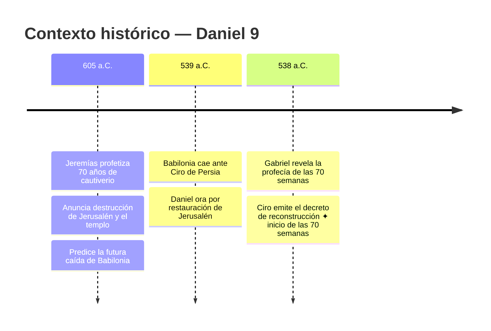

En el 605 a. C., Jeremías profetizó que Israel sería llevado cautivo a Babilonia durante 70 años y que Jerusalén y su templo serían destruidos. También profetizó que al final de este período Babilonia caería. En el 539 a. C., Babilonia cayó ante Ciro de Persia. En consecuencia, en ese mismo año, sintiendo el cumplimiento de la profecía de Jeremías, Daniel oró por la restauración de Jerusalén. Gabriel (como mensajero de Dios) respondió a la oración de Daniel con la profecía de las 70 semanas, cuyo comienzo sería un decreto para reconstruir y restaurar la ciudad. ¡En el 538 a. C., Ciro emitió precisamente tal decreto! El punto, entonces, es este. El decreto de Ciro en 539-38 a. C. es tanto la conclusión de la profecía de Jeremías sobre el cautiverio (2 Crónicas 36:21–23) como el comienzo de la profecía de Daniel sobre las 70 semanas de restauración (Daniel 9:25).

Storms, S. (2016). Daniel (Dn 9:24–27). Sam Storms.

