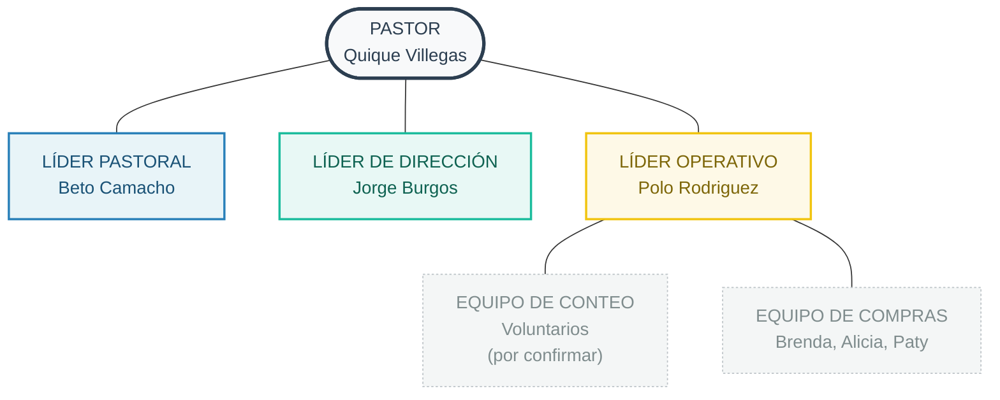

![[GrowingPlant.jpeg|banner]]

### A.  General

La existencia de un Equipo de Finanzas en Gracia Soberana Orizaba responde a una necesidad bíblica y práctica. 

Bíblica, porque Dios se revela como dueño de todo y declara que los diezmos y ofrendas son “cosa consagrada al Señor”, lo que exige una administración santa, sobria y responsable de los recursos de la iglesia. Además, la Escritura muestra que el pueblo de Dios sostiene el ministerio, la adoración y a los necesitados mediante ofrendas ordenadas y supervisadas (Lev 27; 1 Co 16; 2 Co 8–9). 

Práctica, porque las decisiones financieras impactan directamente nuestra capacidad de predicar el evangelio, cuidar a la congregación y participar en la misión e interdependencia con otras iglesias Gracia Soberana; por ello necesitamos un equipo confiable que reciba, registre, resguarde y distribuya los recursos con transparencia, en dependencia del Señor y bajo la supervisión del pastor.

Esta es una descripción del equipo de finanzas

> El Equipo de Finanzas sirve a Gracia Soberana Orizaba administrando los recursos que el Señor nos confía, para que nuestra iglesia pueda atesorar, seguir y proclamar el evangelio con fidelidad. 

Aunque este ministerio no es menos espiritual que otros, sino todo lo contrario: las decisiones financieras expresan nuestra adoración, nuestra confianza en Dios y nuestras prioridades en la misión.

---

### B. Estructura del equipo

GSO es una iglesia en plantación con un pastor único. La estructura del equipo de finanzas refleja esa realidad: es simple, ágil y con líneas de autoridad claras. Cada rol tiene funciones propias que no se solapan con los demás.

---

### C. Roles

#### 1. Pastor *(Quique Villegas)*

Como pastor único de GSO en esta etapa de plantación, Quique tiene la responsabilidad y autoridad espiritual. Su rol en finanzas es de supervisión y aprobación, no de operación.

**Responsabilidades en finanzas:**
- Nombrar y remover a los miembros del equipo de finanzas.
- Recibir el reporte mensual del Tesorero (a través de Jorge o directamente).
- Aprobar el presupuesto anual y cualquier ajuste significativo.
- Autorizar gastos que excedan el presupuesto aprobado.
- Pastorear al equipo: orar con ellos, cuidar su salud espiritual, afirmar que su servicio es adoración.

**Lo que el pastor no hace operativamente:**
- Contar ofrendas ni manejar efectivo de manera regular.
- Llevar registros contables.
- Aprobar compras menores ya contempladas en el presupuesto (eso corresponde al Tesorero con guía de Jorge).

#### 2. Líder de Finanzas *(Jorge Burgos)*

Jorge forma parte del equipo de liderazgo de GSO y es el responsable de que el área de finanzas funcione con dirección pastoral y alineación con la visión de la iglesia. Su rol es de **gobierno y dirección**, no de operación diaria.

La distinción clave: El líder decide el *qué* y el *por qué*; el coordinador ejecuta el *cómo*.

**Responsabilidades:**

*Dirección y alineación pastoral*
- Velar porque las decisiones financieras reflejen los valores y prioridades de GSO.
- Participar en la elaboración del presupuesto anual, asegurando que refleje la visión de la iglesia.
- Ser el enlace entre el pastor y el Tesorero: llevar al pastor las necesidades o decisiones que requieren su aprobación.
- Supervisar que los recursos se usen según lo presupuestado y con integridad.

*Pastoreo del equipo*
- Orar con el equipo de finanzas y recordarles regularmente que su servicio es espiritual.
- Acompañar a los miembros del equipo, reconocer su trabajo, escuchar sus inquietudes, cultivar un ambiente de confianza.

*Revisión y aprobación dentro de su nivel*
- Recibir el reporte mensual del Tesorero y revisarlo antes de presentarlo al pastor.
- Autorizar gastos que el tesorero le traiga y que estén dentro del presupuesto, cuando el monto o la naturaleza lo ameriten.
- Resolver con el tesorero situaciones no contempladas antes de escalarlas al pastor.

**Lo que no hace:**
- Llevar registros contables ni manejar comprobantes directamente.
- Aprobar unilateralmente gastos fuera del presupuesto (eso requiere al pastor).

#### 2. Líder Pastoral (Beto Camacho)
Su función primordial no es administrativa, sino espiritual. Beto es el encargado de que el equipo administrativo y operativo mantenga los ojos puestos en Jesús. Existe para evitar que el manejo de los recursos, por más excelente que sea, se convierta en una tarea técnica y secular. Su presencia asegura que recordemos que estamos manejando "cosa consagrada al Señor".

##### Responsabilidades Clave:
- **Cultivar la Adoración en el Equipo**: Inicia cada junta del equipo administrativo con un tiempo de oración, enfocándose en la dependencia de Dios.
- **Pastorear al Equipo de Conteo**: Antes de que el equipo de conteo inicie sus funciones, Beto se reúne con ellos brevemente para orar, dar gracias por la provisión de Dios a través de la congregación, y recordarles que su minucioso trabajo es un acto de adoración.
- **Cuidado Pastoral**: Está atento a la salud espiritual y las cargas de cada miembro del equipo de finanzas, orando con ellos y por ellos. Es el primer punto de contacto para las luchas personales dentro del equipo.

##### Lo que Beto no hace:
- No toma decisiones presupuestarias ni aprueba gastos.
- No lleva registros contables ni maneja efectivo.
- Su rol no es de supervisión operativa, sino de vitalidad espiritual.

#### 3. Líder de visión _(Jorge Burgos)_
Jorge es el responsable de traer visión y dirección estratégica al área financiera, asegurando que esté en línea con la misión y los valores de GSO. Actúa como un filtro sabio, madurando las decisiones y las tensiones antes de que escalen al pastor. Es un rol de gobierno que se ejerce en estrecha colaboración con el pastor, en un proceso de discipulado activo mientras crece en su comprensión de lo que buscamos como iglesia.

##### Responsabilidades Clave:
- **Traer Visión a los Números:** Participa en la elaboración del presupuesto anual desde una perspectiva estratégica, preguntando: "¿Este presupuesto refleja nuestras prioridades misionales para el año?".
- **Filtro de Decisiones:** Recibe las propuestas, tensiones o necesidades de gasto del Líder Operativo (Polo). Las procesa, ora por ellas, y discierne cuáles requieren ser escaladas al pastor y cuáles pueden resolverse en el diálogo con el equipo, siempre dentro del presupuesto aprobado.
- **Enlace Estratégico con el Pastor:** Es el canal formal para llevar al pastor las recomendaciones del equipo administrativo, presentando la tensión saludable entre la visión (Líder de Dirección) y la mayordomía (Líder Operativo).

- **Discipulado y Alineación:** Se reúne regularmente con el pastor no solo para reportar, sino para ser discipulado en su vida personal y equipado en la vision biblica de una iglesai saludable.

**Lo que Jorge no hace:**
- No ejecuta tareas operativas como registros o conteo.
- No aprueba unilateralmente gastos fuera del presupuesto.

#### 4. Lider financiero *(Polo Rodriguez)*

Es el responsable operativo de las finanzas de GSO. El pastor le ha encomendado explícitamente *cuidar* las finanzas: con integridad, orden y transparencia, buscando la manera de maximizar el presupuesto, hacer rendir cada peso que el Señor provee.

Esta orientación puede generar una tensión con los otros miembros del equipo, y esa tensión es **intencional**. EL líder de finanzas trae la visión pastoral que a veces requiere invertir con generosidad o fe; El tesorero trae la responsabilidad de cuidar lo que la congregación ha ofrendado y asegurarse de que se use bien. Ninguno de los dos tiene razón por defecto: es precisamente ese diálogo, entre la visión y la mayordomía, entre la misión y el orden, lo que produce decisiones financieras sabias. Cuando no se ponen de acuerdo, escalan al pastor.

**Responsabilidades:**

*Registros y administración*
- Registrar de forma puntual y ordenada todos los ingresos y egresos.
- Resguardar comprobantes, facturas y registros (físicos y digitales).
- Mantener el archivo financiero al día y ordenado.

*Presupuesto*
- Elaborar, junto con El líder de finanzas y el pastor, un presupuesto anual.
- Proponer ajustes al presupuesto cuando la provisión o las prioridades lo requieran.
- Verificar que todo gasto cuente con espacio presupuestal antes de ejecutarse.

*Autorización de gastos (dentro del presupuesto)*
- Aprobar solicitudes de gasto de los ministerios cuando estén contempladas en el presupuesto y sean de monto menor.
- Consultar con el líder de finanzas antes de aprobar gastos de mayor volumen, aunque estén en el presupuesto.
- Nunca aprobar gastos fuera del presupuesto sin autorización del líder de finanzas y del pastor.

*Coordinación del Equipo de Conteo*
- Coordinar al equipo de conteo: confirmar turnos, asegurar que siempre estén las dos presentes, recibir y archivar el formato de conteo firmado.
- Coordinar y verificar los depósitos bancarios.
**Lo que no hace sin consultar:**
- Aprobar compras o pagos fuera del presupuesto.
- Comprometer recursos para proyectos o compromisos nuevos.
- Acordar colectas o fondos especiales de manera informal con miembros.

#### 4. Equipo de Conteo *(Pendiente de encargar)*

> [!note] Nota
> Debido a la situacion laboral de Dany, este ministerio ha quedado sin cubrir. Oremos par que pronto tengamos un equipo que sirva en esta área.

Son los encargados de la integridad física de los recursos: contar, registrar y entregar. Su fidelidad protege la integridad del equipo y de ellas mismas.

**Principio de protección mutua:** Siempre las dos presentes en el conteo. Nunca una sola persona maneja el efectivo. Esto no es desconfianza,  es sabiduría bíblica y cuidado mutuo.

**Responsabilidades:**
- Estar disponibles cada domingo para el conteo (o coordinarse con anticipación si alguna no puede).
- Abrir sobres y contar el efectivo juntas, inmediatamente después del culto o en el momento definido.
- Reportar el (fecha, monto por categoría: diezmos, ofrenda especial, otros) y actualizar los documentos.

**Si una de las dos no puede asistir un domingo:**
Debe avisarle al tesorero con anticipación para que coordine un reemplazo. El conteo no puede hacerlo una sola persona.

#### 5. Equipo de Compras
El Equipo de Compras atiende las necesidades operativas de GSO: insumos de limpieza, papelería, alimentos, consumibles y otros gastos menores recurrentes. Su existencia libera a Polo y Dany de la gestión de compras, permitiéndoles enfocarse en sus otros ministerios.

##### Coordinadora de Compras: *([[Brenda]])*

Brenda es la cabeza logística del equipo. Su rol es de coordinación y administración, no de ejecución directa de compras.

**Flujo de trabajo:**
1. El encargado de ministerio le reporta a Brenda el faltante por WhatsApp.
2. Brenda acumula las solicitudes y las encomienda a Alicia o Paty según disponibilidad.
3. Cuando el presupuesto está por agotarse, solicita nuevos fondos al tesorero

**Responsabilidades:**
- Recibir las solicitudes de compra de los encargados de ministerio.
- Asignar cada compra a un miembro del equipo.
- Llevar el registro de compras y el control del presupuesto autorizado en esta [Hoja de Cálculo](https://docs.google.com/spreadsheets/d/1jr4tDp_KVcKP6isfdRFJmwRucRDi1JBLcd-zzsruKh0/edit?usp=sharing)
- Recibir y archivar los comprobantes de cada compra en [esta carpeta](https://drive.google.com/drive/folders/1IR0XM3eIg4sjh1zrC9AgDVd96zdM1hX_?usp=sharing) 
- Entregar comprobantes al tesorero puntualmente.
- Solicitar nuevos fondos al tesorero cuando el presupuesto lo requiera.

**Herramientas:** 
- **Lista maestra de insumos:** productos por categoría, proveedor habitual y encargado de ministerio.
- **Registro de compras:** cada compra, su costo y el presupuesto restante.

##### Equipo ejecutor: *(Alicia y Paty — por confirmar)*

Alicia y Paty ejecutan las compras que Brenda les asigna.

**Responsabilidades:**
- Realizar las compras asignadas por Brenda dentro del presupuesto indicado.
- Entregar el comprobante a Brenda a más tardar 48 horas después de la compra.
- Avisar a Brenda con anticipación si no pueden atender una compra asignada.

### D. Pagos 

#### Fijos
Para abril de 2026 nuestra iglesia local tiene los siguientes pagos fijos:

| Concepto           | Frecuencia | Tipo       | Cantidad |
| ------------------ | ---------- | ---------- | -------- |
| Renta              | Mensual    | Monto fijo | $12 000  |
| Salario del pastor | Semanal    | Monto fijo | $4 000   |
| Pago de Internet   | Mensual    | Monto fijo | $380     |
| Luz                | Bimestral  | Aproximado | $600     |
| Limpieza           | Semanal    | Monto fijo | $300     |
| Compras varias     | Mensual    | Aproximado | $1500    |
| Jardinería         | Mensual    | Aproximado | $200     |
| Fondo de misiones  | Mensual    | Fijo       | $1500    |

#### Extraordinarios que se deben tener considerados

Además de los gastos fijos, existen necesidades que no ocurren cada mes pero que deben estar presentes en la planificación financiera. Anticiparlos evita que tomen al equipo por sorpresa y permite responder con orden cuando se presenten.

- Materiales didácticos para escuela dominical
- Libros para el ministerio pastoral
- Apoyo de gasolina para el pastor
- Apoyo para creyentes en necesidad o enfermedad
- Mantenimiento del local
- Equipo de audio
- Apoyo para viajes de capacitación

---

> [!links] Relacionado:
>- [[Finanzas en Gracia Soberana Orizaba]]
>- [[Filosofía ministerial de Gracia Soberana Orizaba]]
>- [[07 Convicciones para la dirección de la Iglesia]]
>- [[Honestidad]]
>- [[Ofrendas y Diezmos]]
>- [[Ministerio cristiano]]
>- [[Ministerio en Gracia Soberana Orizaba]]
> 
>---
>*Ultima actualización: 23/04/2026*