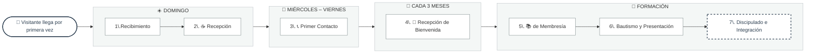

```mermaid
flowchart LR

    V([👤 Visitante llega por primera vez]):::visitor

    subgraph DOM["☀️ DOMINGO"]
        direction LR
        A["1\.Recibimiento"]:::stepMain
        B["2\. ☕ Recepción "]:::stepMain
    end

    subgraph SEM["📅 MIÉRCOLES – VIERNES"]
        C["3\. 📞 Primer Contacto"]:::stepMain
    end

    subgraph TRI["📆 CADA 3 MESES"]
        D["4\. 🎂 Recepción de Bienvenida"]:::stepMain
    end

    subgraph FORM["📖 FORMACIÓN"]
        direction LR
        E["5\. 📚 de Membresía"]:::stepMain
        F["6\. Bautismo y Presentación"]:::stepMain
        G["7\. Discipulado e Integración"]:::stepFinal
    end

    V --> DOM
    A --> B
    DOM --> SEM
    SEM --> TRI
    TRI --> FORM
    E --> F
    F --> G

    %% Definición de estilos sobrios (Grises y Azul Marino)
    classDef visitor fill:#fff,color:#2c3e50,stroke:#2c3e50,stroke-width:2px;
    classDef stepMain fill:#fff,color:#333,stroke:#7f8c8d,stroke-width:1px;
    classDef stepFinal fill:#fff,color:#2c3e50,stroke:#2c3e50,stroke-width:2px,stroke-dasharray: 5 5;

    %% Estilo para los subgrafos (Fondo gris muy claro)
    style DOM fill:#f4f7f6,stroke:#bdc3c7,stroke-width:1px
    style SEM fill:#f4f7f6,stroke:#bdc3c7,stroke-width:1px
    style TRI fill:#f4f7f6,stroke:#bdc3c7,stroke-width:1px
    style FORM fill:#f4f7f6,stroke:#bdc3c7,stroke-width:1px
```

