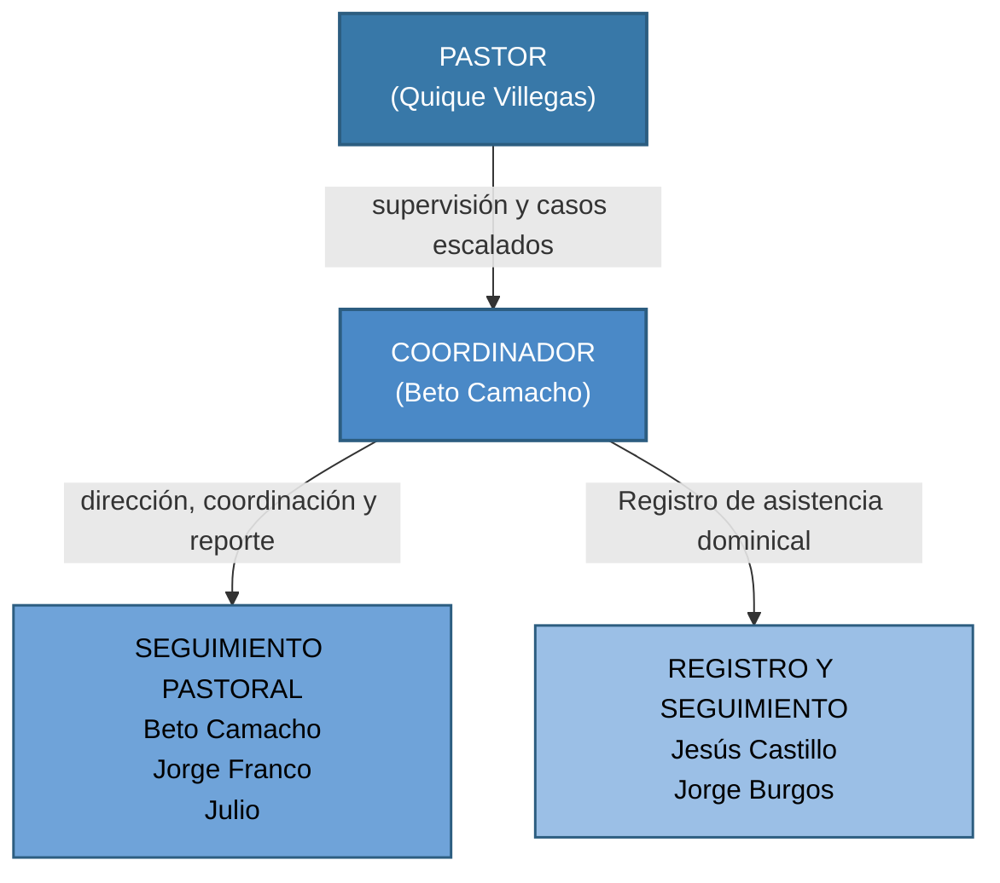
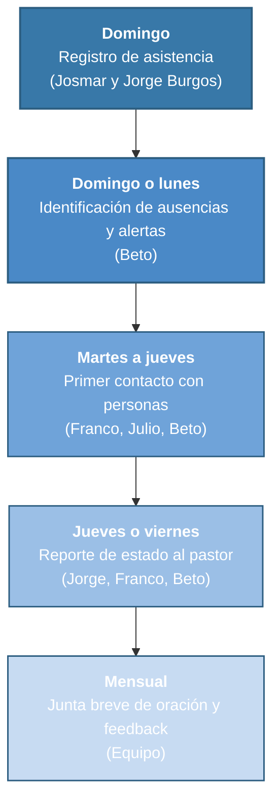

![[Equipo de apoyo pastoral.png|banner]]

> [!bible] Ezequiel 34:4
> «No han fortalecido a las débiles, ni curado a la enferma, ni vendado a la herida, ni han hecho volver a la descarriada, ni han buscado a la perdida.»

### I. Base Bíblica y Necesidad

#### 1. El llamado al cuidado del rebaño

El pastorado no es administración ni predicación solamente. Es cuidado de almas. Hechos 20:28 describe la responsabilidad de quienes lideran la iglesia con una imagen contundente:

> [!bible] Hechos 20:28
> «Tengan cuidado de ustedes mismos y de toda la grey, en medio de la cual el Espíritu Santo los ha hecho obispos para pastorear la iglesia de Dios.»

La palabra "toda la grey" no deja excepciones. No solo los que participan activamente. No solo los que son fáciles de cuidar. El pastor es responsable de *todos* los que el Señor ha puesto bajo su cuidado.

Ezequiel 34 es uno de los textos más solemnes de la Escritura sobre este tema. Dios no reprende a los pastores de Israel por falta de visión o de elocuencia, los reprende por haber descuidado a las débiles, las enfermas, las heridas, las descarriadas y las perdidas. Ese estándar sigue vigente para la iglesia local.

#### 2. Un solo pastor no puede cuidar a todos

Esta no es una realidad nueva. A lo largo de la historia bíblica, Dios mismo ha provisto modelos de delegación para que el cuidado llegue a todos.

##### Éxodo 18, El consejo de Jetro a Moisés:
Moisés juzgaba al pueblo desde la mañana hasta la noche. Su suegro Jetro observó el agotamiento y dio un consejo que venía de parte de Dios:

> [!bible] Éxodo 18:21–22
> «Además, escoge de entre todo el pueblo hombres capaces, temerosos de Dios, hombres veraces que aborrezcan las ganancias injustas… que sean jefes de mil, de cien, de cincuenta y de diez. Ellos juzgarán al pueblo en todo tiempo; y todo asunto grave lo traerán a ti, pero todo asunto pequeño lo resolverán ellos mismos.»

El principio es claro: los casos ordinarios los atienden hombres de confianza; los casos que trascienden su capacidad llegan al líder. Esa estructura no debilita el liderazgo, lo protege y lo hace sostenible.

##### Hechos 6, Los siete en la iglesia de Jerusalén:
Cuando la iglesia creció y surgieron necesidades prácticas de cuidado que los apóstoles no podían atender sin descuidar la Palabra y la oración, la solución no fue ignorar las necesidades ni sobrecargar a los apóstoles. La solución fue delegar en hombres llenos del Espíritu Santo.

> [!bible] Hechos 6:3–4
> «Hermanos, escojan de entre ustedes a siete hombres de buena reputación, llenos del Espíritu Santo y de sabiduría, a quienes podamos encargar esta tarea; nosotros nos dedicaremos a la oración y al ministerio de la palabra.»

La delegación en Hechos 6 fue un acto de obediencia que liberó a los apóstoles para su llamado principal y aseguró que nadie en la iglesia quedara sin cuidado.

#### 3. El modelo bíblico: delegar con sabiduría

Delegar no es abandonar. El pastor sigue siendo responsable delante de Dios por el estado del rebaño (Hebreos 13:17). Lo que cambia es el *mecanismo* por el cual ese cuidado llega a las personas.

> El Equipo de Apoyo Pastoral no reemplaza al pastor ni ejerce autoridad pastoral. Es un brazo extendido que le permite al pastor mantenerse al tanto del estado de la congregación, atender con oportunidad a quienes lo necesitan y enfocar su tiempo en los casos que genuinamente requieren su presencia directa.

### II. Descripción y Propósito

El **Equipo de Apoyo Pastoral** es el ministerio encargado de identificar, registrar y dar seguimiento a las personas de la congregación que muestran señales de vulnerabilidad o alejamiento, especialmente aquellas que no participan activamente en un programa de discipulado.

> Su propósito es ser la primera línea de cuidado pastoral en GSO: asegurando que nadie se aleje en silencio, que las necesidades sean detectadas a tiempo y que el pastor pueda actuar con información clara sobre el estado real de su rebaño.

**El equipo no reemplaza al pastor ni a los líderes de discipulado.** Es el puente que conecta al pastor con personas que de otro modo pasarían desapercibidas.

---

### III. Estructura del Equipo

Un equipo integrado de cuatro personas, cada una con un rol definido, coordinadas por Beto Camacho, quien reporta directamente al pastor.

---

### IV. Roles y Responsabilidades

#### 1. Coordinador: Beto Camacho

Beto es el responsable de que el equipo funcione con consistencia y de que la información fluya de manera ordenada hacia el pastor. Su papel es principalmente **coordinar** al equipo.

**Responsabilidades:**
- Organizar las reuniones periódicas del equipo (bimestrales)
- Revisar los registros y verificar que las personas sean atendidas.
- Facilitar la comunicación interna y asegurar que cada miembro cumpla su rol con claridad.

---

#### 2. Seguimiento Pastoral: Jorge Franco y Julio (Cordoba) / Beto (Orizaba)

**Responsabilidades:**
- Orar activamente por las personas que se han identificado como prioritarias.
- Contactarlas (por llamada, mensaje o visita), ofreciendo el acompañamiento, apoyo, oración y la palabra para animar
- Reportar al pastor el resultado de cada contacto: cómo está la persona, qué necesita, si la situación requiere escalar.

#### 3. Registro y Seguimiento, *Josmar y Jorge Burgos*

Jesus Castillo y Jorge Burgos serán los ojos del equipo: registran lo que sucede semana a semana y levantan alertas cuando algo cambia.

**Responsabilidades:**
- Registrar la asistencia al culto dominical en Notion.
- Mantener actualizado la base de datos.

---

### V. Criterios de Activación del Seguimiento

#### Casos que el equipo atiende directamente

El equipo activa seguimiento de forma autónoma cuando detecta cualquiera de estas situaciones:

- **Ausencia al culto**: 2 domingos consecutivos sin aviso  
- **Retiro de actividades**: Dejar de participar en reuniones o eventos de manera notable  
- **Enfermedad reportada**: Por el propio hermano, un familiar o un miembro de la iglesia  
- **Desánimo general**: Reportado directamente o perceptible en interacciones recientes  
- **Dificultades cotidianas**: Problemas matrimoniales, laborales o familiares de carácter ordinario  

Ante cualquiera de estas señales, Franco, Julio o Beto, realizan un primer contacto. No se espera que la persona llegue sola.

#### Casos que se escalan al pastor

Hay situaciones que exceden la capacidad y la autoridad del equipo. Cuando se detecte cualquiera de los siguientes, lo comunican al pastor antes de actuar:

- Crisis espiritual severa (duda de fe, abandono de la fe).
- Situaciones que pudieran requerir disciplina eclesiástica.
- Conflictos interpersonales graves dentro de la iglesia.
- Problemas de salud mental o situaciones de riesgo.
- Dificultades matrimoniales que requieren intervención más allá del aliento.
- Cualquier caso en el que el equipo sienta que no tiene la capacidad para acompañar bien.

> La regla es simple: ante la duda, escalar. Es mejor llevar al pastor un caso que no lo requería, que retener uno que sí lo necesitaba.

### VI. Flujo de Trabajo

#### Ritmo semanal

| Momento          | Acción                                     | Quién                 |
| ---------------- | ------------------------------------------ | --------------------- |
| Domingo          | Registro de asistencia                     | Josmar y Jorge Burgos |
| Domingo o lunes  | Identificación de ausencias y alertas      | Beto                  |
| Martes a jueves  | Primer contacto con personas identificadas | Franco, Julio, Beto   |
| Jueves o viernes | Reporte de estado de cada caso al pastor   | Jorge, Franco, Beto   |

#### Ritmo mensual

- Si se considera necesario, tendremos una junta breve una vez al mes con el objetivo de orar por los hermanos y hacer un feedback

---

*Gracia Soberana Orizaba, Versión 1.0, Abril 2026*
