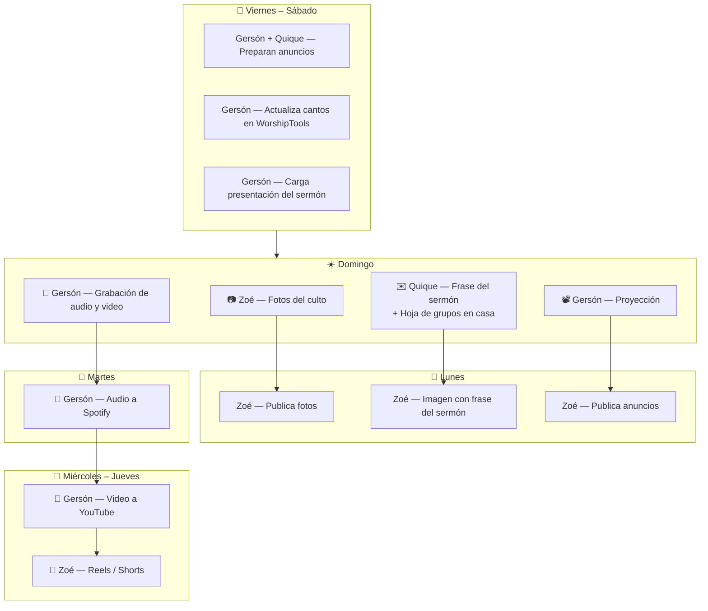

> [!info] Estado del flujo
> Las tareas marcadas con 🔶 están en **fase de pruebas** — ya se están ejecutando pero aún no se publican de forma regular. Las demás están en **operación activa**.

---

### Domingo

#### Durante el culto

| Responsable | Tarea |
| ----------- | ----- |
| Zoé | Tomar fotografías del culto y los momentos de reunión |
| Gersón | Operar la proyección con los anuncios preparados |
| Gersón | 🔶 Grabar el audio y video del sermón |

#### Por la tarde

| Responsable | Tarea |
| ----------- | ----- |
| Quique | Enviar a Zoé: **frase del sermón** seleccionada + **hoja de preguntas para grupos en casa** |

> [!important] Punto de arranque semanal
> El envío del pastor el domingo por la tarde es la señal de inicio para el trabajo de Zoé el lunes. Sin ese envío, no se publican frases esa semana.

---

### Lunes

| Responsable | Tarea |
| ----------- | ----- |
| Zoé | Publicar fotografías del culto en Facebook e Instagram |
| Zoé | Diseñar y publicar imagen estática con la frase del sermón |
| Zoé | Publicar anuncios de la semana en Facebook e Instagram |

---

### Martes

| Responsable | Tarea |
| ----------- | ----- |
| Gersón | 🔶 Editar el audio del sermón y subir episodio a Spotify |

Ver proceso completo en [[Proceso de publicación del Podcast]].

---

### Miércoles – Jueves

| Responsable | Tarea |
| ----------- | ----- |
| Gersón | 🔶 Editar el video del sermón y subir a YouTube |
| Zoé | 🔶 Producir reels o shorts a partir del video editado |

> [!info] Dependencia
> Los reels y shorts dependen de que el video de Gersón esté editado. Zoé no puede producir ese contenido hasta contar con el material.

---

### Viernes – Sábado

| Responsable | Tarea |
| ----------- | ----- |
| Gersón y Quique | Preparar anuncios de la semana para proyección del domingo |
| Gersón | Revisar y actualizar las letras de los cantos en WorshipTools |
| Gersón | Cargar la presentación del sermón o los textos bíblicos indicados por el pastor |

> [!info] Cierre del ciclo
> La preparación del fin de semana garantiza que el domingo el equipo llega a operar, no a improvisar.

---

### Diagrama del flujo

---

*Gracia Soberana Orizaba — Ministerio de Medios — Abril 2026*
