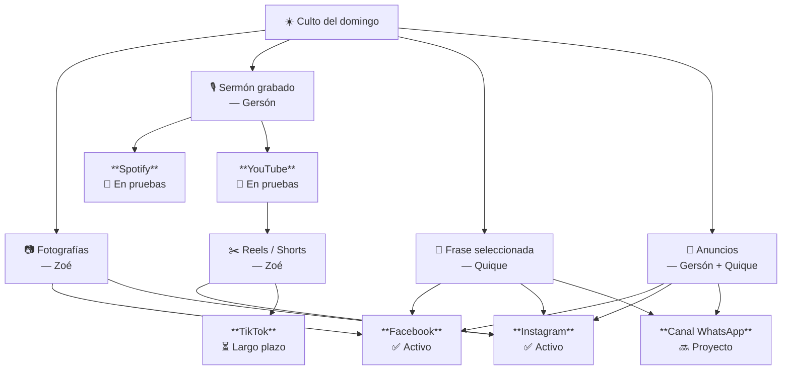

![[logo-produccion.png|400]]

> [!bible] Colosenses 4:5–6
> «Andad sabiamente para con los de afuera, aprovechando bien el tiempo. Sea vuestra palabra siempre con gracia, sazonada con sal, para que sepáis cómo debéis responder a cada uno.»

### 1. Justificación

Las redes sociales son un espacio público amplio al que tenemos acceso en el siglo XXI. Lo que GSO publica en Facebook e Instagram no llega únicamente a sus miembros: llega a vecinos, familiares de congregantes, hermanos de otras iglesias y personas en quienes el Espíritu ha puesto necesidad del Señor.

> [!important] Principio rector
> Nuestras redes sociales no son un canal de entretenimiento ni de autopromoción, sino una extensión de la misión de la iglesia: proclamar a Cristo y su evangelio con fidelidad.

Eso significa que nuestras redes son, en la práctica, la primera impresión que muchos tendrán de nuestra iglesia. Y esa impresión comunica algo, para bien o para mal, sobre quiénes somos, qué creemos y a quién adoramos.

Por esta razón el manejo de redes no debería ser improvisado. No se trata de acumular seguidores ni de seguir tendencias digitales. Se trata de que lo que publicamos refleje fielmente el carácter del evangelio que predicamos.

---

### 2. Propósito

El propósito del manejo de redes sociales de GSO es triple:

- **Anunciar.** Comunicar las actividades, recursos y vida de la iglesia a la comunidad, especialmente a personas que aún no nos conocen o que no pueden asistir presencialmente.
- **Edificar.** Publicar contenido que fortalezca la fe de los miembros: fragmentos de sermones, versículos, reflexiones breves que reflejen nuestro compromiso con la Palabra.
- **Representar.** Proyectar hacia la comunidad quiénes somos: una iglesia comprometida con Cristo y su evangelio.

---

### 3. Plataformas

GSO tiene presencia en varias plataformas digitales, aunque la mayoría no se actualiza con regularidad. El objetivo es activarlas de forma progresiva, conforme el equipo tenga capacidad para sostenerlas con consistencia. Es mejor tener pocas plataformas bien atendidas que muchas abandonadas.

#### 3.1 Facebook
*Estado: cuenta activa, sin actualización regular*

Facebook sigue siendo la red de mayor alcance entre las familias y adultos de nuestra comunidad. Es la plataforma principal para comunicación con la congregación y el entorno inmediato de la iglesia.

**Prioridad: alta — primera en activar.**

Contenido sugerido:
- Anuncios de actividades y eventos
- Fotografías del culto y reuniones
- Transmisión en vivo (cuando se retome)
- Compartir episodios del podcast (cuando se retome)

---

#### 3.2 Instagram
*Estado: cuenta activa, sin actualización regular*

Instagram es una plataforma visual orientada a un público más joven. Es el espacio natural para el trabajo de diseño gráfico del equipo, y el canal más adecuado para proyectar la identidad visual de GSO.

**Prioridad: alta — activar junto con Facebook.**

Contenido sugerido:
- Diseños gráficos para series de predicación
- Citas de sermones con imagen
- Fotografías de eventos y vida comunitaria
- Reels cortos (reflexiones, anuncios, cuando se retome)

---

#### 3.3 YouTube
*Estado: canal existente, sin actualización regular*

YouTube es la plataforma de referencia para contenido de video de largo plazo. Los sermones publicados aquí permanecen accesibles indefinidamente y tienen potencial de alcance orgánico más amplio que otras plataformas.

**Prioridad: media — activar cuando se retome la grabación sistemática de sermones.**

Contenido sugerido:
- Sermones grabados en video
- Series de predicación completas

---

#### 3.4 Spotify
*Estado: podcast activo, sin actualización regular*

Spotify es la plataforma de distribución del podcast de GSO. Es el canal con el proceso más definido (ver [[Proceso de publicación del Podcast]]) y uno de los de mayor alcance geográfico potencial.

**Prioridad: media — reactivar como parte del proyecto de grabación y podcast (Fase 2).**

Contenido sugerido:
- Sermones en formato audio
- Series de predicación

---

#### 3.5 Canal de WhatsApp
*Estado: sin canal — proyecto pendiente*

GSO ya cuenta con un grupo de WhatsApp para miembros, que funciona bien como espacio interno de comunidad. Un canal es distinto: es unidireccional, público y no requiere ser agregado manualmente. Cualquier persona interesada puede seguirlo.

**Prioridad: media — activar cuando Facebook e Instagram estén funcionando con regularidad.**

Contenido sugerido:
- Hoja de preguntas para grupos en casa
- Frase del sermón de la semana
- Anuncios y recordatorios del culto

> [!info] Relación con el grupo existente
> El canal no reemplaza el grupo de miembros. Coexisten con propósitos distintos: el grupo es para comunidad interna, el canal es para comunicación oficial y alcance externo.

---

#### 3.6 TikTok
*Estado: sin cuenta*

TikTok tiene el mayor alcance orgánico entre plataformas en este momento, especialmente hacia audiencias jóvenes. Su formato de video corto exige creatividad, consistencia y un criterio claro sobre qué tipo de contenido es apropiado para representar a GSO.

**Prioridad: baja — considerar a largo plazo, cuando el equipo tenga madurez y capacidad para sostenerlo.**

> [!important] Consideración pastoral
> TikTok requiere un nivel de criterio y madurez más alto que otras plataformas. El formato favorece lo emocional y lo viral por encima de lo sustancial. Antes de abrir una cuenta, el equipo debe tener claro qué tipo de contenido publicará y contar con aprobación pastoral explícita para ello.

---

### 4. Lineamientos

#### 4.1 Aprobación del contenido

- Todo contenido publicado en nombre de GSO debe contar con aprobación del pastor, ya sea explícita (para publicaciones nuevas o sensibles) o implícita (para contenido rutinario dentro de los parámetros establecidos).
- En caso de duda, siempre consultar antes de publicar.
- No publicar declaraciones teológicas, posicionamientos sobre temas controversiales ni respuestas a críticas sin aprobación pastoral previa.

#### 4.2 Privacidad y fotografías

- No publicar fotografías de menores de edad sin autorización expresa de sus padres o tutores.
- No publicar imágenes de personas que hayan pedido explícitamente no aparecer en redes.
- En reuniones privadas (consejería, grupos pequeños, reuniones de liderazgo), no tomar ni publicar fotografías sin consentimiento explícito de los presentes.

#### 4.3 Tono y voz

- El tono debe ser cálido, claro y accesible — sin caer en lo frívolo o en lo sensacionalista.
- Evitar lenguaje de "marketing religioso": frases grandilocuentes, promesas vacías o hipérboles emocionales.
- El humor es bienvenido cuando es genuino, pero no debe trivializar lo sagrado.
- No utilizar las redes de GSO para expresar opiniones políticas, personales o polémicas ajenas a la misión de la iglesia.

#### 4.4 Frecuencia y tipos de contenido

| Tipo de publicación                         | Frecuencia sugerida    |
| ------------------------------------------- | ---------------------- |
| Anuncios de actividades                     | Según calendario       |
| Fotografías del culto o eventos             | Después de cada evento |
| Contenido devocional (versículo, reflexión) | 1–2 veces por semana   |
| Repost de contenido externo                 | Solo con aprobación    |

#### 4.5 Gestión de comentarios y mensajes

- Responder mensajes directos relacionados con actividades de la iglesia en un tiempo razonable (máximo 48 horas).
- No entrar en debates teológicos o confrontaciones públicas en los comentarios.
- Si alguien hace una pregunta seria sobre la fe o solicita contacto pastoral, notificar al pastor de inmediato.
- Comentarios ofensivos o inapropiados pueden ocultarse; eliminarlos permanentemente requiere criterio y, si hay duda, consulta al pastor.

#### 4.6 Uso de identidad gráfica

- Todas las publicaciones de diseño deben seguir los lineamientos gráficos de GSO (paleta de colores, tipografía, estilo).
- No usar logos, imágenes o marcas de terceros sin permiso.
- Las plantillas aprobadas por el equipo de diseño son el punto de partida estándar para todas las publicaciones gráficas.

---

### 5. Flujo de trabajo proyectado

El diagrama muestra cómo fluye el contenido generado en el culto hacia cada plataforma, y el estado actual de cada una.

> ✅ Activo · 🔶 En pruebas · 🔜 Proyecto pendiente · ⏳ Largo plazo

---

*Gracia Soberana Orizaba — Ministerio de Medios — Abril 2026*
